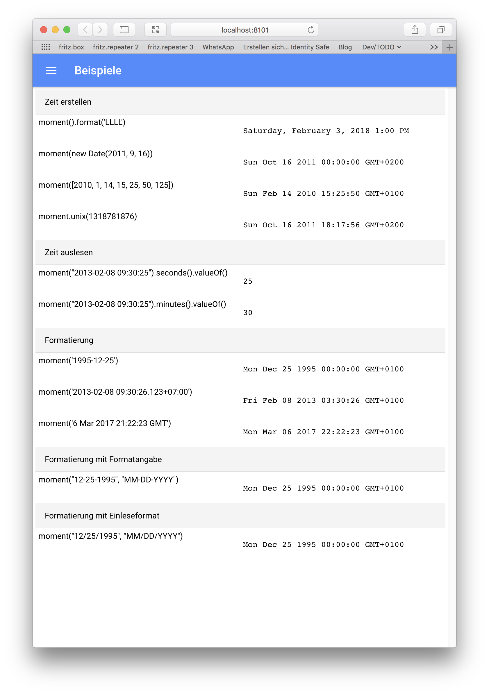
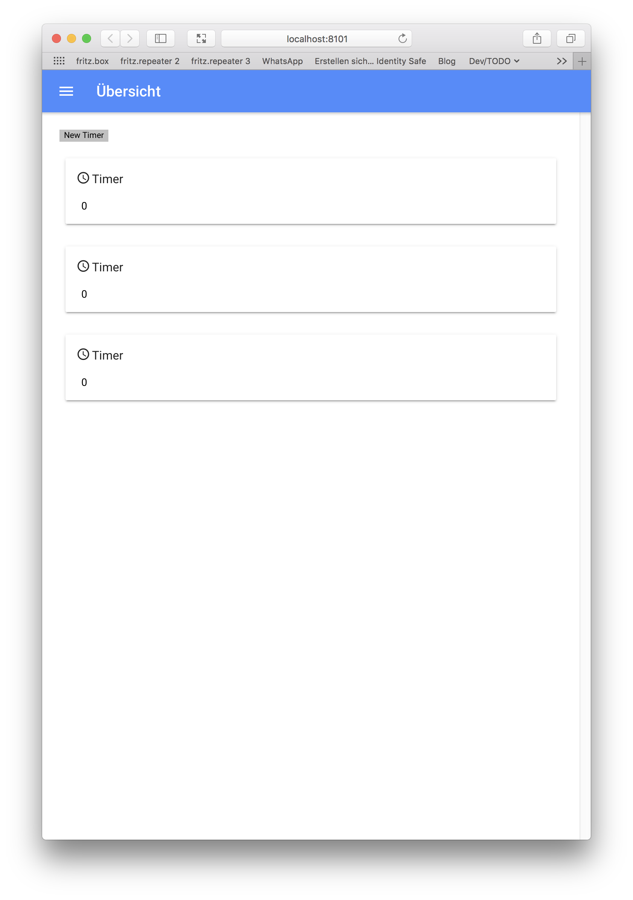
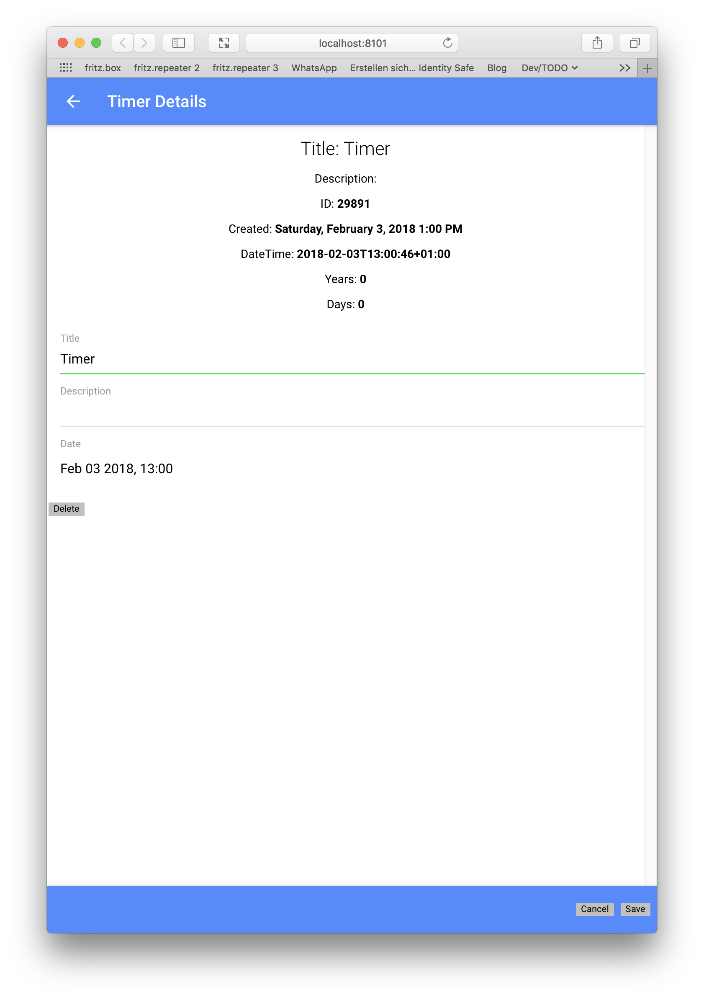

# Using the moments.js library in Ionic 3

Sample Repository to demonstrate the integration of [ moments.js](http://momentjs.com/) in an Ionic 3 App.

## Requirements

    $ npm install moment --save 

## Install

    $ npm install
    $ ionic serve

## Screenshots

List of Moments Samples              |  List of Timers                     |  Timer Details 
:-----------------------------------:|:-----------------------------------:|:-----------------------------------:
 |  |

# More to come
Read my [blog](http://blog.ralph-goestenmeier.de/)
